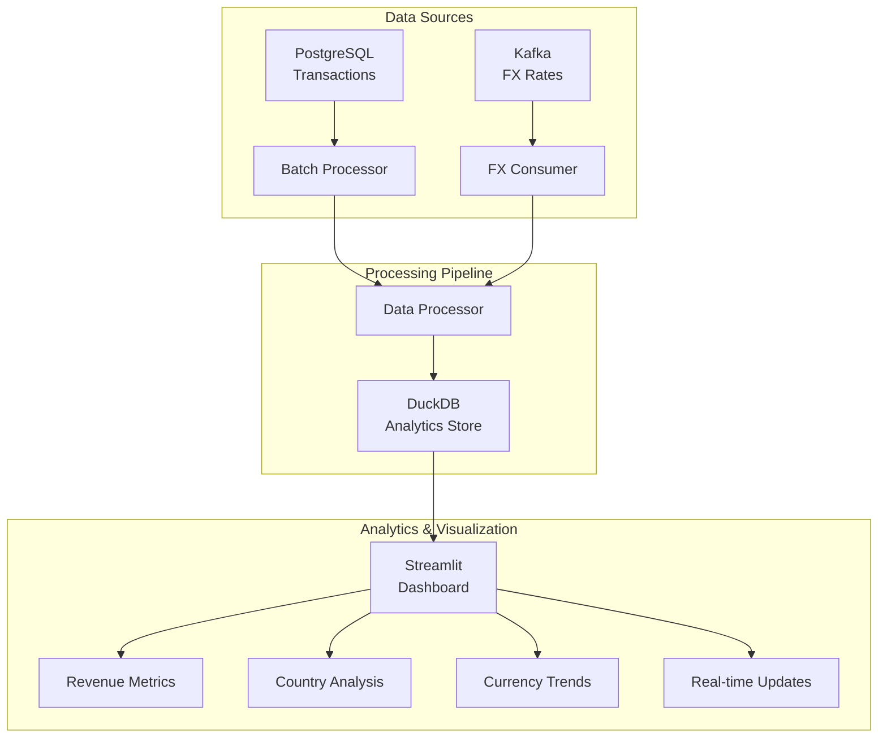

# GlobeMart Real-Time Revenue Insights

A real-time revenue monitoring system for GlobeMart's global e-commerce operations. The system processes transaction data from PostgreSQL, incorporates live FX rates from Kafka, and provides real-time USD-normalized revenue analytics through an interactive Streamlit dashboard.

## System Architecture



## Features

- Real-time revenue monitoring in USD
- Hourly transaction batch processing
- Live FX rate updates
- Interactive analytics dashboard
- Historical trend analysis
- Country-wise revenue breakdown
- Currency distribution insights

## Prerequisites

- Python 3.8+
- Docker and Docker Compose
- PostgreSQL (or Docker container)
- Kafka (or Docker container)

## Quick Start

1. Clone the repository:
```bash
git clone https://github.com/Sittiprince/real-time-revenue-insights.git
cd real-time-revenue-insights
```

2. Create and activate virtual environment:
```bash
python -m venv venv
# Windows
.\venv\Scripts\activate
# Linux/Mac
source venv/bin/activate
```

3. Install dependencies:
```bash
pip install -r requirements.txt
```

4. Start required services:
```bash
docker-compose up -d
```

5. Run the system:
```bash
# Start the pipeline
python main.py

# In a new terminal, start the dashboard
streamlit run src/dashboard/streamlit_app.py
```

## Configuration

The system can be configured through environment variables:

```bash
# PostgreSQL Configuration
POSTGRES_HOST=localhost
POSTGRES_PORT=5432
POSTGRES_DB=globemart
POSTGRES_USER=dataeng
POSTGRES_PASSWORD=pipeline123

# Kafka Configuration
KAFKA_BOOTSTRAP_SERVERS=localhost:9092
KAFKA_FX_TOPIC=fx-rates

# Analytics Configuration
DUCKDB_PATH=data/analytics.duckdb
```

## Project Structure

```
real-time-revenue-insights/
├── src/
│   ├── data_ingestion/
│   │   ├── postgres_connector.py
│   │   ├── batch_processor.py
│   │   ├── batch_scheduler.py
│   │   └── fx_rates_consumer.py
│   ├── storage/
│   │   └── duckdb_manager.py
│   └── dashboard/
│       └── streamlit_app.py
├── tests/
│   ├── test_batch_ingestion.py
│   ├── test_fx_consumer.py
│   └── test_integration.py
├── data/
├── docker-compose.yml
├── requirements.txt
└── README.md
```

## Testing

Run the test suite:

```bash
# Run all tests
python -m pytest

# Run specific test file
python -m pytest tests/test_integration.py

# Run with coverage
python -m pytest --cov=src
```

## Dashboard Features

The Streamlit dashboard provides:

1. Real-time Revenue Metrics
   - Total revenue in USD (with simulated growth indicators)
   - Active countries count
   - Transaction count
   - Currency distribution

2. Interactive Visualizations
   - Revenue by country (bar chart)
   - Currency distribution (pie chart)
   - Hourly revenue trends (line chart)
   - FX rate changes

3. Analysis Controls
   - Time range selection (12/24 hours)
   - Manual refresh button
   - Country/currency filters

## Known Issues

1. Dashboard Metrics
   - The "+1" and "+2" indicators for currencies and active countries are currently hardcoded mock values for development purposes

2. FX Rate Processing
   - The DuckDB manager currently shows errors related to missing `update_fx_rates` method
   - FX rate updates may not be properly reflected in real-time
   - Working on implementing proper FX rate update functionality

3. Transaction Processing
   - Some transactions may be rejected due to validation rules
   - Transaction ID format must match pattern: TX-XXXXXXXXXX-YYYY
   - Country codes must be in ISO format (e.g., US, GB, DE)

## Troubleshooting

If you encounter issues:

1. Check the logs for detailed error messages
2. Ensure all services (PostgreSQL, Kafka) are running
3. Verify database connections and credentials
4. Check if transaction data follows the required format
5. Ensure FX rates are being properly ingested

## Production Deployment

For production deployment:

1. Update environment variables with production credentials
2. Configure proper security measures:
   - Enable Kafka authentication
   - Set up PostgreSQL SSL
   - Configure firewall rules
3. Set up monitoring and alerting
4. Use proper logging configuration

## Contributing

1. Fork the repository
2. Create your feature branch
3. Commit your changes
4. Push to the branch
5. Create a Pull Request

## License

This project is licensed under the MIT License - see the LICENSE file for details.

## Support

For support, please contact the development team or create an issue in the repository.

